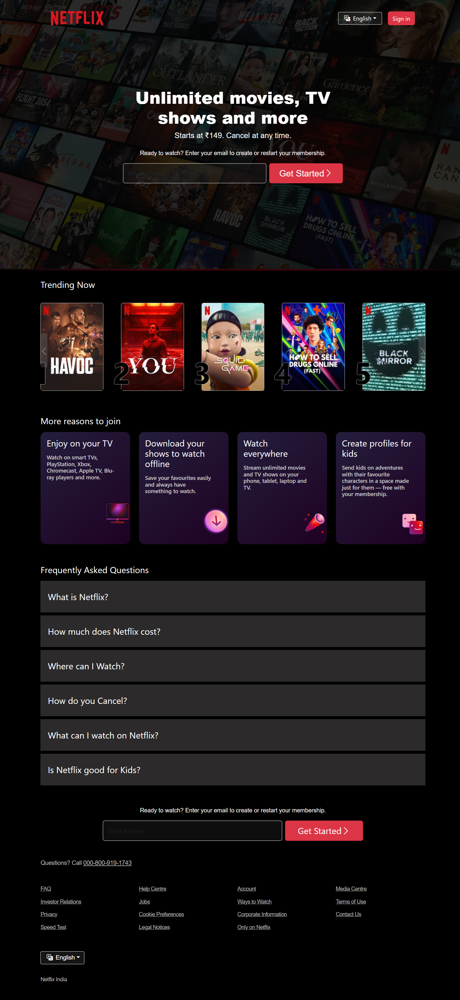

# Netflix Clone

This is a responsive **clone of the Netflix homepage**, recreated using modern front-end technologies:

- **HTML**
- **CSS**
- **Bootstrap**
- **React.js**

> ⚠️ **Disclaimer**: This project is for **educational and personal learning purposes only**. It is not affiliated with or endorsed by Netflix in any way. All logos, branding, and content belong to their respective owners.

---

## 🔍 Live Preview

  
*A screenshot of the Netflix clone homepage built with React.*

---

## 🧰 Features

- Hero section with background and call-to-action
- Responsive layout and media queries
- Bootstrap-based grid and component styling
- Interactive FAQ accordion
- Email input call-to-action
- Carousel-style "Trending Now" section
- Clean, modern UI
